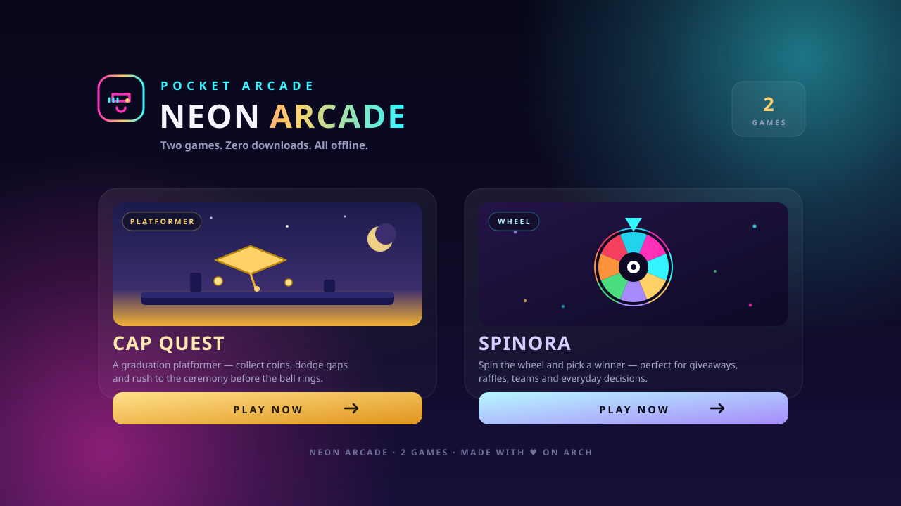

<p align="center">
  
</p>

---

# 🎮 Neon Arcade

> **A pocket arcade** — two polished games behind one neon landing page. Each game is an
> independent app with its own build, so the hub stays fast and nothing bleeds between them.
> Everything runs in the browser — no accounts, no installs, no server.

<p align="center">
  <a href="https://jeevannar16-web.github.io/Gaming-Hub/">
    
  </a>
  <a href="https://jeevannar16-web.github.io/Gaming-Hub/games/pickora/">
    
  </a>
  
  
  
  
</p>

**▶ Play it live:** <https://jeevannar16-web.github.io/Gaming-Hub/> — pick a card, and you're in.

---

## 🕹️ The collection

### 🎓 Cap Quest — a graduation platformer

A hand-rolled canvas platformer. Collect coins, ride moving platforms, hit bounce pads, and
reach the ceremony before the bell rings. It ships with a save system, power-ups, wind zones
and a dusk-gold theme — playable with **A/D** or **←/→**, jump on **Space**, and fully
touch-native on mobile with an on-screen d-pad.

### 🎡 Spinora — random picker & spin wheel

A dark-mode-first winner-selection wheel, drawn in **pure SVG** with 8 wheel styles, 8 built-in
themes plus a full theme editor, confetti, tick sounds, **winner history**, CSV/JSON import and
export, and a fullscreen **presentation mode** (Space to spin, Esc to exit). Everything persists
to `localStorage`, so nothing ever leaves your device.

Its full documentation lives in [`games/pickora/`](./games/pickora) — the original project,
vendored into this hub with its full commit history intact.

---

## 🏗️ How it's built

The hub does **not** bundle the games into one JavaScript file. Each game under `games/` is an
independent Vite app that gets built on its own and staged into `public/games/<name>/`, so
Vite then ships it as a plain static app. That keeps the games' frameworks and dependency trees
completely separate, and the hub's own bundle stays small.

```
Game_Hub/
├── index.html                 Hub shell (Vite, React 18)
├── scripts/build-games.mjs    Builds every game in games/* and stages it
├── src/
│   ├── components/HubHome.tsx The Neon Arcade landing page
│   └── game/                  Cap Quest engine, canvas, level, audio
├── games/pickora/             Spinora — independent app (React 19, Vite 8, Tailwind 4)
└── public/                    Static output (games/ is generated, git-ignored)
```

### 📦 Scripts

| Command | Description |
| --- | --- |
| `npm run dev` | Hub dev server on `:5173` |
| `npm run build` | Build **all** games, then type-check and build the hub |
| `npm run build:games` | Build only the games and stage them into `public/games/` |
| `npm run preview` | Serve the production build (honours the `/Gaming-Hub/` base) |

> Use `build:games` before `dev` if you want the games available on the dev server — the dev
> server does not run the game build step for you.

## 🧪 Testing

```bash
cd games/pickora
npm test            # Vitest unit tests — wheel math, selection, validation
npm run test:e2e    # Playwright — desktop + mobile projects
npm run lint        # oxlint
npm run typecheck   # tsc
```

The hub is type-checked with `tsc` on every build. Playwright's Chromium is already available
locally, so the end-to-end suite runs without extra setup.

## ☁️ Deployment

`.github/workflows/deploy.yml` builds everything and publishes `dist/` to GitHub Pages on every
push to `main`. The site is served as a project page, so both apps are base-path aware:

- Hub — `base: '/Gaming-Hub/'`
- Spinora — `base: '/Gaming-Hub/games/pickora/'`

If you fork or rename the repo, update both `base` values to match your Pages path.

## 🛠 Tech stack

**Hub** — React 18 · TypeScript · Vite 5 · Canvas 2D
**Spinora** — React 19 · TypeScript · Vite 8 · Tailwind CSS v4 · Zustand · Framer Motion · Radix UI

## 📄 License

Cap Quest is part of this hub. Spinora is MIT — see [`games/pickora/LICENSE`](./games/pickora/LICENSE).

---

<p align="center">
  <sub>Built with 💜 on Arch Linux — <a href="https://github.com/jeevannar16-web/Gaming-Hub">source on GitHub</a></sub>
</p>
