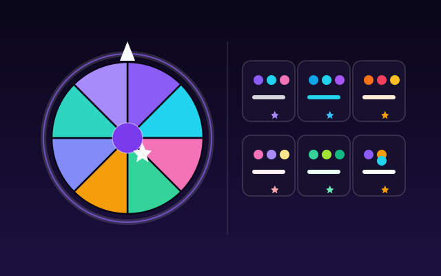
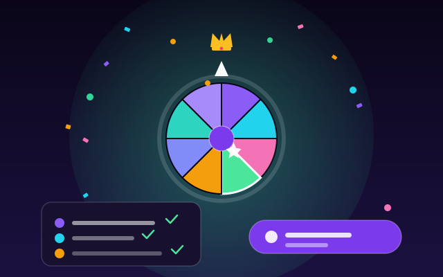
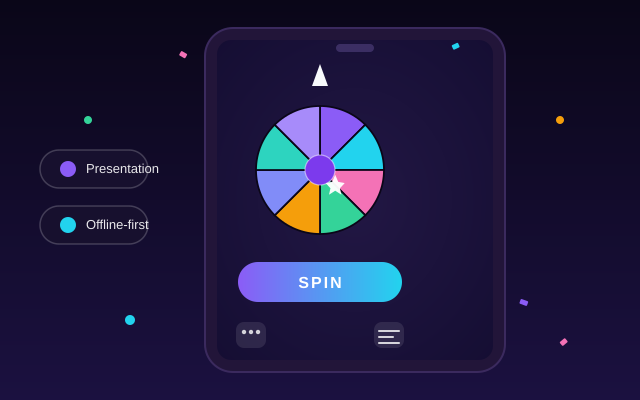

<p align="center">
  
</p>

---

# 🎡 Spinora

> **Spin. Suspense. Winner.** — a polished, dark-mode-first random-picker / winner-selection
> wheel, built as a fully client-side progressive web app. Everything runs in your browser —
> no accounts, no uploads, no server.

<p align="center">
  <a href="https://pickorad.netlify.app">
    
  </a>
  
  
  
  
  
  
</p>

**▶ Try it live:** <https://pickorad.netlify.app> — no sign-up, works from any device, fully offline-capable once loaded.

---

## ✨ Highlights

### 🎨 A wheel for every mood

<p align="center">
  
</p>

The wheel is drawn in **pure SVG** — no canvas, no dependencies — with **8 wheel styles**,
matching **pointer & hub designs**, and winner math that is fully unit-tested. Eight built-in
themes (Aurora, Midnight Neon, Ocean, Sunset, Candy, Emerald, Royal Gold, Minimal Mono) cover
the default look; a full **theme editor** lets you craft your own segment palette, pointer and
hub.

### 🏆 The winner's moment

<p align="center">
  
</p>

Spin once or let multiple winners share the spotlight — duplicates allowed or not, with
**zero-restart spins**. Every draw lands with a satisfying settle, optional **confetti** and
**tick sounds**, then is recorded in the **winner history** with its ID, mode and results —
perfect for giveaways, raffles, team picks and classroom draws.

### 📱 On the go, full screen

<p align="center">
  
</p>

**Presentation mode** takes the wheel fullscreen — **Space** to spin, **Esc** to exit — for
projector moments. The app is **mobile-first Responsive**: a bottom-nav layout with bottom
sheets, no horizontal overflow (covered by end-to-end tests), and everything — names,
themes, settings and history — persisted in `localStorage`, so the wheel is exactly where
you left it.

## 🌟 Feature list

- **Custom SVG wheel** — 8 wheel styles, various pointer & hub designs; winner math unit-tested.
- **Zero-restart spins** — single or multiple winners, duplicates allowed or not.
- **8 built-in themes** + a full **theme editor** to build your own.
- **Rich settings** — wheel size, spin duration & easing, confetti, tick sounds, winner mode, and more.
- **Winner history** — every draw recorded with its ID, mode and results.
- **Bulk management** — paste a list, import/export CSV & JSON, duplicate detection, undo, search, and built-in starter packs.
- **Presentation mode** — fullscreen wheel, Space to spin, Esc to exit.
- **Accessibility-first** — reduced-motion support, keyboard navigation, landmarks, screen-reader labels.
- **Private by design** — all data lives in `localStorage`; nothing ever leaves your device.

## 📦 Scripts

| Command | Description |
| --- | --- |
| `npm run dev` | Start the Vite dev server |
| `npm run build` | Type-check + production build to `dist/` |
| `npm run preview` | Preview the production build locally |
| `npm run typecheck` | TypeScript type checking |
| `npm run lint` | Oxlint |
| `npm run test` | Vitest unit tests |
| `npm run test:e2e` | Playwright end-to-end tests |

## 🧪 Testing

- **45 unit tests** — random selection, all-or-nothing semantics, multi-winner without duplicates, deterministic wheel-segment/pointer alignment math.
- **21 end-to-end tests** (Playwright, desktop + mobile projects) — add, spin, winners, history and presentation flows, plus mobile layout (bottom-nav, bottom sheets, no horizontal overflow).

```bash
npm run test        # unit tests
npx playwright test # e2e tests (desktop + mobile projects)
```

## 🛠 Tech stack

**React 19 · TypeScript 6 · Vite · Tailwind CSS v4 · Zustand · Framer Motion · Radix UI · canvas-confetti · Vitest · Playwright**

## 🚀 Quick start

```bash
npm install
npm run dev        # http://localhost:5173
```

## ☁️ Deployment

A fully static SPA — `npm run build` outputs production assets to `dist/`. Free-tier friendly:

- **Netlify** — connect the GitHub repo and it auto-deploys on push (`netlify.toml` + header/redirect rules included).
- **Cloudflare Pages** — same flow; `public/_headers` + `public/_redirects` included.
- **GitHub Pages** — set `base: '/Pickora/'` in `vite.config.ts`, add the canonical Pages workflow, and enable **Settings → Pages → GitHub Actions**.

Quick manual deploy (Netlify Drop):

```bash
npm run build
# drag the `dist/` folder to https://app.netlify.com/drop
```

## 📄 License

[MIT](./LICENSE)

---

<p align="center">
  <sub>Built with 💜 for moments that deserve a little drama — <a href="https://pickorad.netlify.app">give it a spin</a></sub>
</p>